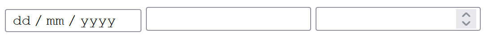
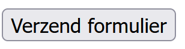
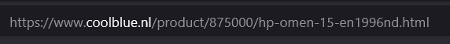

# BACKEND - Les 1

## Inhoudsopgave

- [BACKEND - Les 1](#backend---les-1)
  - [Inhoudsopgave](#inhoudsopgave)
    - [Formulier](#formulier)
    - [Input field](#input-field)
    - [Submit](#submit)
      - [Zelf proberen](#zelf-proberen)
    - [HTTP(S)](#https)
    - [URL](#url)
    - [Requests](#requests)
    - [Client-Server](#client-server)
    - [GET method](#get-method)
    - [POST method](#post-method)
    - [Name-attribuut](#name-attribuut)
    - [$_POST array](#_post-array)

### Formulier

Als je een gegevens wilt __opslaan__ of je wilt een __zoek-functie__ maken of je wilt een gebruiker kunnen laten __inloggen__ dan kun je daarvoor een HTML formulier gebruiken.
Een html formulier begint altijd met: `<form>` en je sluit het altijd af met `</form>`

Je kunt het bestand `test.html` openen om te bekijken wat in deze readme wordt besproken.

### Input field

In het formulier zet je altijd een paar invulvelden. Dit kunnen tekst velden zijn maar bijvoorbeeld ook een datum veld of getallen veld. Je gebruikt hiervoor `<input>`. Om aan te geven welke soort input je wilt hebben van de gebruiker dien je het attribuut `type` ook te gebruiken. Dit ziet er dan zo uit:

```html
<form>
    <input type="date">
    <input type="text">
    <input type="number">
</form>
```

Dit ziet er dan zo uit



### Submit

Om zo'n ingevuld formulier te versturen moet de gebruiker in de browser wel een handeling verrichten. Meestal gebruiken we daar een knop voor:



Dit codeer je met de volgende HTML:

```html
<button type="submit">Verzend formulier</button>
```

Je ziet dat ook hier het `type`-attribuut is gebruikt. Het heeft de waarde _submit_ gekregen. Dit betekent indienen. Net als bij het gemeentehuis. Het indienen van een ingevuld formulier.

#### Zelf proberen

> Probeer het maar eens met de code die bij dit bestand staat

### HTTP(S)

Dit indienen gebeurd via een protocol over het web. Het heet Hyper Text Transfer Protocol ofwel __HTTP__. En tegenwoordig via een beveiligd protocol __HTTPS__, HTTP Secure.

Via dit protocol kun je websites opvragen (dus bekijken) maar je kunt dus ook gegevens opsturen met een formulier. Je vraagt een website op bij een webserver.

### URL

Een website opvragen doe je zodra je op een link klikt of zodra je een URL (Universal Resource Locator) intypt.


### Requests

Dit opvragen noemen we een _verzoek_ doen. Ofwel een __request__. Je weet van de te voren niet of een website bestaat of online is. Daarom noemen we dit een verzoek. Er zijn verschillende soorten _requests_, voor nu is het belangrijk om te weten dat __GET__ en __POST__ request methodes bestaan.

### Client-Server

Als jij een drankje besteld op een terras dan vraag je de ober om een drankje. Je vraagt bijvoorbeeld "Mag ik een cola?". Je weet niet of het cafe cola in huis heeft maar je doet wel het verzoek (request). De ober geeft antwoord: "Natuurlijk! Ik kom het zo brengen!". De ober kan nu het drankje uitserveren. Dit lijkt wel op hoe websites werken:


Je vraag via een link of een website bestaat en een webserver _serveert_ de site aan de klant (client = browser) uit.


### GET method

Als je een website opvraagt dan haal je informatie op, hiervoor gebruiken we de __GET__ method. Elke keer als je een site bezoekt dan gebeurt dit met een `get-request`-methode. De URL hieronder vraagt een bepaald type laptop op.



Het handige aan een GET-method is dat je deze kunt bookmarken (bladwijzer) in je browser zodat je later snel weer naar terug kunt naar dezelfde webpagina.

### POST method

Wil je data versturen van de client naar de server dan gebruiken we meestal de `post-request`-methode. Hiervoor heb je een formulier nodig. Je kunt verschillende soorten datatypes versturen met de POST-method.

Om dit aan te geven moeten we aan het `<form>`-tag ook een attribuut toekennen: `method="post"`.

Het formulier van hierboven ziet er dan zo uit:

```html
<form method="post">
    <input type="date">
    <input type="text">
    <input type="number">
    <button type="submit"></button>  
</form>
```

### Name-attribuut

Met dit formulier kun je bijna de ingevulde gegevens versturen naar de server. We missen echter nog een belangrijk attribuut en dat is `name`. Dit geldt voor alle input types maar je kunt het ook op de button toepassen:

```html
<form method="post">
    <input type="date" name="geboortedatum" >
    <input type="text" name="naam" >
    <input type="number" name="leeftijd" >
    <button type="submit" name="submit" ></button>  
</form>
```

Je hebt dit attribuut nodig om de ingevulde waardes in op te slaan met PHP.

### $_POST array

Stel, jij vult het formulier in:

> - Geboortedatum: 01-01-2001 
> - Naam: Bart Simpson
> - Leeftijd: 20

Om deze gegevens naar de server te versturen gebruiken we een array. Je weet dat een array een lijstje is met gegevens. Omdat we bij dit formulier hebben aangegeven dat het formulier de `post-request`-method gebruikt maken we ook gebruik van een speciale array: `$_POST`. Dit is een associatieve array, wat wil zeggen dat de keys (index) bestaan uit strings.

Zodra je bovestaande gegevens hebt ingevuld ziet de `$_POST`-array er als volgt uit:

```php
echo $_POST["geboortedatum"] // "01-01-2001";
echo $_POST["naam"] // "Bart Simpson";
echo $_POST["leeftijd"] // "20";
```

Dus zodra je op de _submit_-knop drukt wordt de $_POST-array gevuld met de waardes van inputfields.
